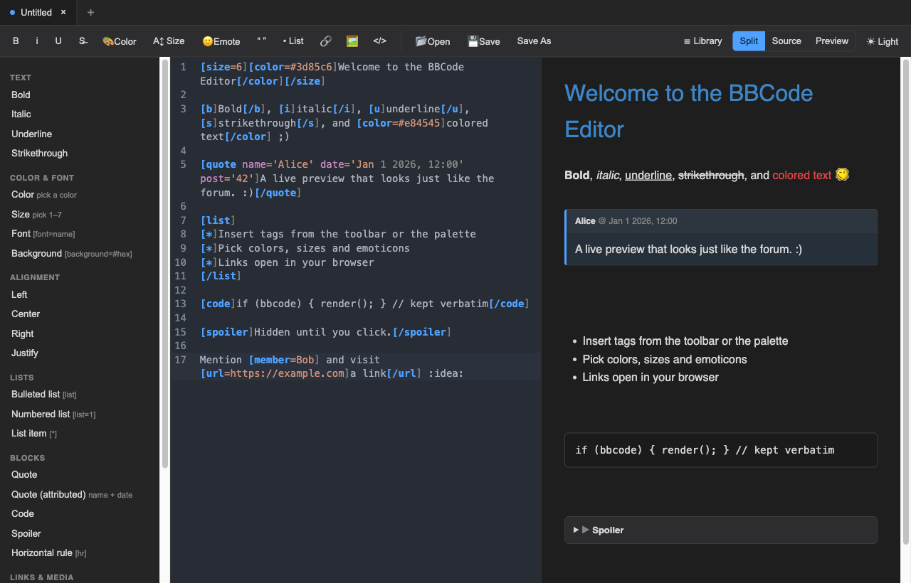
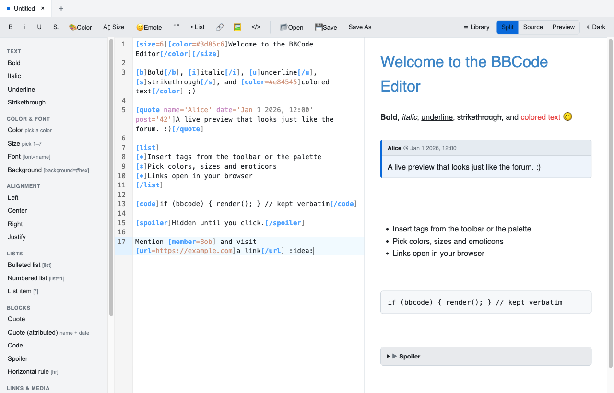
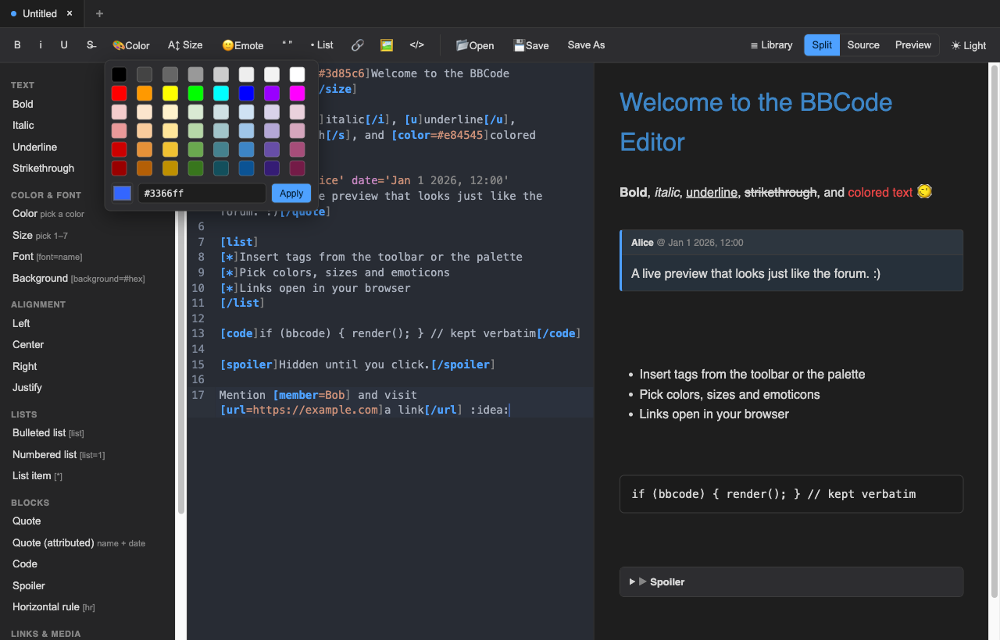
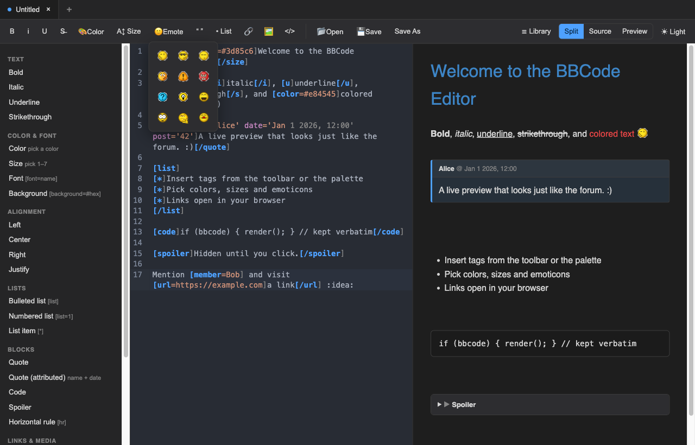

# BBE

**BBE** (BBCode Editor) — a lightweight cross-platform (macOS / Windows / Linux)
**BBCode** editor with a source view and a live, forum-style preview, built with
**Tauri 2** (Rust) + **TypeScript**.

It targets the **IP.Board / Invision Community** BBCode dialect, so what you see
in the preview is what the forum will render.

## Screenshots

Split view (source + live preview), dark and light themes:





A color picker with predefined swatches, and the forum's emoticon set:





## Download

Prebuilt installers for macOS, Windows, and Linux are published on the
[Releases page](https://github.com/KalinRangelovRangelov/BBE/releases).

> The macOS build is ad-hoc signed (no Apple Developer ID). On first launch,
> right-click the app and choose **Open** to bypass the Gatekeeper warning.

## Features

- **Source + Preview** with three view modes: split (synced scroll), source-only,
  preview-only — toggle in the toolbar or with `Cmd/Ctrl+1/2/3`.
- **IP.Board BBCode**: `[b] [i] [u] [s]`, `[color] [size] [font] [background]`,
  alignment, lists, `[url] [email] [img]`, attributed `[quote name='' date='']`,
  `[code]` (kept verbatim), `[spoiler]`, `[member]`, `[acronym]`, `[hr]`, and
  `[youtube]/[media]` video embeds. The preview is sanitized (no script execution;
  iframes are limited to YouTube/Vimeo embeds).
- **Element library**: a formatting toolbar plus a browsable sidebar palette
  covering the whole tag set — inserts a snippet at the cursor or wraps the
  selection.
- **Color picker** — a swatch grid of predefined colors plus a custom-color input.
- **Size dropdown** — a `1–7` menu, each option shown at its rendered size.
- **Emoticons** — the forum's 12 default smilies; clicking inserts the code
  (e.g. `:blink:`) which the preview renders as the image.
- **Links open in your browser** — clicking a preview link opens it in your
  default browser, not inside the app.
- **Multi-tab** editing with per-tab unsaved-change indicators and a quit guard.
- **File operations**: New / Open / Save / Save As via native dialogs;
  associates with `.bbcode`, `.bb`, and `.txt` files.

## Prerequisites

- [Node.js](https://nodejs.org) 18+ and npm
- [Rust](https://rustup.rs) toolchain (stable)
- Linux only: `libwebkit2gtk-4.1-dev`, `libgtk-3-dev`, `libayatana-appindicator3-dev`,
  `librsvg2-dev`, `build-essential` (see the Tauri Linux prerequisites docs).

## Develop

```bash
npm install
npm run tauri dev      # launches the desktop app with live reload
```

## Test

```bash
npm test               # vitest: BBCode rendering + tab-state logic
```

## Build installers

```bash
npm run tauri build
```

Produces a native bundle for the current OS in
`src-tauri/target/release/bundle/`:

| OS      | Artifact               |
| ------- | ---------------------- |
| macOS   | `.app` and `.dmg`      |
| Windows | `.msi` (and `.exe`)    |
| Linux   | `.AppImage` and `.deb` |

Build on each target OS to produce that platform's installer.

## Releasing

Releases are built and published automatically by the GitHub Actions workflow
[`.github/workflows/release.yml`](.github/workflows/release.yml). It runs
[`tauri-apps/tauri-action`](https://github.com/tauri-apps/tauri-action) on a
macOS / Windows / Linux matrix and uploads the installers to a GitHub Release.

**Trigger:** push a `v*` tag (it also supports manual `workflow_dispatch`):

```bash
git tag v0.1.0
git push origin v0.1.0
```

This produces a GitHub Release named `BBCode Editor v0.1.0` with:

| Platform | Asset                                            |
| -------- | ------------------------------------------------ |
| macOS    | `.dmg` (universal — Intel + Apple Silicon)       |
| Windows  | `.msi` and NSIS `.exe`                            |
| Linux    | `.AppImage` and `.deb`                            |

Builds are unsigned (no Apple/Windows certificates), so users get a first-launch
OS warning — add signing secrets to the workflow to remove it.

## Keyboard shortcuts

| Action                   | Shortcut               |
| ------------------------ | ---------------------- |
| New / Open               | `Cmd/Ctrl + N / O`     |
| Save / Save As           | `Cmd/Ctrl + S / ⇧S`    |
| Close tab                | `Cmd/Ctrl + W`         |
| Source / Split / Preview | `Cmd/Ctrl + 1 / 2 / 3` |

## Project layout

```
src/                Frontend (TypeScript)
  editor.ts         CodeMirror 6 wrapper + snippet insertion
  bbcode-lang.ts    CodeMirror syntax highlighting for [tags]
  bbcode-preset.ts  IP.Board tag set (BBob preset)
  preview.ts        BBob → DOMPurify → emoticons
  emoticons.ts      The forum's smilies (inlined)
  colorpicker.ts    Color swatch popup
  sizepicker.ts     1–7 size dropdown
  emojipicker.ts    Emoticon popup
  popup.ts          Shared anchored-popup helper
  library.ts        Toolbar + palette definitions
  tabs.ts           Tab/document model
  main.ts           Wiring: UI, file ops, shortcuts, link handling
src-tauri/          Rust backend (file read/write commands, window, file assoc.)
tests/              Vitest unit tests
```

## License

MIT
